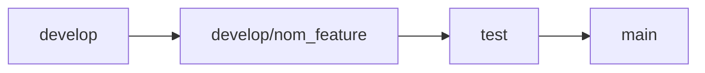

# Guide des Bonnes Pratiques Git

Ce projet démontre les meilleures pratiques pour la gestion des branches et des commits dans un projet professionnel.

## Table des Matières

1. [Structure des Branches](#structure-des-branches)
2. [Convention de Nommage des Commits](#convention-de-nommage-des-commits)
3. [Workflow Détaillé](#workflow-détaillé-pour-les-stagiaires)
4. [Bonnes Pratiques Quotidiennes](#bonnes-pratiques-quotidiennes)
5. [Résolution des Problèmes Courants](#résolution-des-problèmes-courants)
6. [Outils de Qualité](#outils-de-qualité)
7. [Installation](#installation)
8. [Astuces Git Utiles](#astuces-git-utiles)
9. [Processus de Pull Request](#processus-de-pull-request)
10. [Tests et Scripts Utilitaires](#tests-et-scripts-utilitaires)

## Structure des Branches

### Branches Protégées

- `main` : Branche de production uniquement
  - ⚠️ Aucun commit direct n'est autorisé
  - Les modifications ne peuvent venir que de `develop` via Pull Request
  - Représente le code en production

- `develop` : Branche principale de développement
  - ⚠️ Aucun commit direct n'est autorisé
  - Intègre toutes les nouvelles fonctionnalités validées
  - Source pour créer vos branches de travail

### Branches de Travail (Pour les Stagiaires)

En tant que stagiaire, vous devez TOUJOURS créer votre branche à partir de `develop`. Le nom de votre branche doit suivre cette convention :

```
<type>/<description-courte>
```

Les types de branches correspondent aux types de modifications que vous allez apporter :

1. **`feature/`** - Pour les nouvelles fonctionnalités
   - Quand utiliser : Lorsque vous développez une nouvelle fonctionnalité
   - Format : `feature/nom-de-la-feature`
   - Exemples :
     ```bash
     git checkout -b feature/authentification-utilisateur
     git checkout -b feature/formulaire-contact
     git checkout -b feature/integration-api
     ```

2. **`fix/`** - Pour les corrections de bugs
   - Quand utiliser : Lorsque vous corrigez un bug existant
   - Format : `fix/description-du-bug`
   - Exemples :
     ```bash
     git checkout -b fix/erreur-validation-email
     git checkout -b fix/correction-calcul-total
     git checkout -b fix/affichage-mobile
     ```

3. **`docs/`** - Pour la documentation
   - Quand utiliser : Lorsque vous modifiez ou ajoutez de la documentation
   - Format : `docs/description-modification`
   - Exemples :
     ```bash
     git checkout -b docs/guide-installation
     git checkout -b docs/api-endpoints
     ```

4. **`style/`** - Pour les modifications de style
   - Quand utiliser : Pour les changements qui n'affectent pas la logique (CSS, formatage, etc.)
   - Format : `style/description-changement`
   - Exemples :
     ```bash
     git checkout -b style/refonte-theme-principal
     git checkout -b style/responsive-design
     ```

### Workflow Détaillé pour les Stagiaires

1. **Toujours partir de develop à jour**
   ```bash
   git checkout develop
   git pull origin develop
   ```

2. **Créer votre branche avec le bon type**
   ```bash
   # Si vous ajoutez une nouvelle fonctionnalité
   git checkout -b feature/ma-nouvelle-fonctionnalite

   # Si vous corrigez un bug
   git checkout -b fix/correction-bug-specifique

   # Si vous mettez à jour la documentation
   git checkout -b docs/mise-a-jour-guide
   ```

3. **Travailler sur votre branche**
   - Faites vos modifications
   - Testez votre code
   - Committez régulièrement (voir section suivante)

4. **Maintenir votre branche à jour**
   ```bash
   # Mettre à jour develop
   git checkout develop
   git pull origin develop

   # Retourner sur votre branche
   git checkout feature/ma-nouvelle-fonctionnalite
   git merge develop

   # Résoudre les conflits s'il y en a
   ```

5. **Finaliser votre travail**
   ```bash
   # Vérifier que tous les fichiers sont ajoutés
   git status

   # Ajouter vos modifications
   git add .

   # Créer un commit descriptif
   git commit -m "feature: ajouter la validation du formulaire" -m "Implémentation de la validation côté client avec les règles suivantes:
   - Vérification du format email
   - Validation du mot de passe
   - Messages d'erreur personnalisés"

   # Pousser vos modifications
   git push origin feature/ma-nouvelle-fonctionnalite
   ```

6. **Créer une Pull Request**
   - Allez sur GitHub/GitLab
   - Créez une Pull Request vers `develop`
   - Attendez la revue de code
   - Appliquez les modifications demandées si nécessaire

## Convention de Nommage des Commits

Chaque commit doit suivre ce format :
```
<type>: <description courte>

<description détaillée des modifications>
```

### Types de Commits
- `feat`: Nouvelle fonctionnalité
- `fix`: Correction de bug
- `docs`: Modification de la documentation
- `style`: Changements de style (formatage, espaces, etc.)
- `refactor`: Refactorisation du code
- `test`: Ajout ou modification de tests
- `chore`: Tâches de maintenance

### Exemples de Bons Commits

```bash
# Pour une nouvelle fonctionnalité
git commit -m "feat: ajouter la validation des formulaires" -m "- Ajout de la validation email
- Vérification de la force du mot de passe
- Messages d'erreur en français
- Tests unitaires ajoutés"

# Pour une correction de bug
git commit -m "fix: corriger l'affichage sur mobile" -m "Le formulaire ne s'affichait pas correctement sur les écrans < 768px"

# Pour de la documentation
git commit -m "docs: mettre à jour le guide d'installation" -m "- Ajout des prérequis
- Clarification des étapes d'installation
- Ajout de captures d'écran"
```

## Bonnes Pratiques Quotidiennes

### 1. Fréquence des Commits

✅ **À faire** :
- Commiter fréquemment (idéalement toutes les 1-2 heures de travail)
- Un commit = une modification logique
- Tester votre code avant de commiter

❌ **À éviter** :
- Un seul gros commit en fin de journée
- Plusieurs fonctionnalités dans un seul commit
- Commiter du code non testé

### 2. Messages de Commit

✅ **Bons exemples** :
```bash
# Spécifique et descriptif
git commit -m "feat: ajouter la validation email" -m "- Regex pour format email
- Messages d'erreur personnalisés
- Tests unitaires"

# Correction de bug avec référence
git commit -m "fix: corriger #123 - erreur d'authentification" -m "- Correction du token expiré
- Ajout de la gestion des erreurs"
```

❌ **Mauvais exemples** :
```bash
# Trop vague
git commit -m "fix: corrections"

# Pas de type
git commit -m "ajout de fonctionnalités"

# Message non informatif
git commit -m "feat: mise à jour"
```

### 3. Gestion des Branches

✅ **Bonnes pratiques** :
- Une branche = une fonctionnalité/correction
- Branches courtes (max 1-2 jours de travail)
- Merger régulièrement `develop` dans votre branche

❌ **À éviter** :
- Branches longues durées
- Plusieurs fonctionnalités dans une branche
- Oublier de mettre à jour depuis `develop`

### 4. Pull Requests

✅ **À faire** :
- Titre clair suivant la convention des commits
- Description détaillée des modifications
- Screenshots pour les changements visuels
- Répondre aux commentaires de review

Exemple de bonne PR :
```markdown
Title: feat: implémentation de la page de profil utilisateur

Description:
- Ajout du formulaire de modification de profil
- Upload d'avatar avec preview
- Validation des champs
- Tests unitaires

Screenshots:
[Image du formulaire]
[Image du preview d'avatar]

Tests effectués:
- ✅ Validation des champs
- ✅ Upload d'images
- ✅ Responsive design
- ✅ Tests unitaires passent
```

## Résolution des Problèmes Courants

### 1. Erreur de Commit

**Problème** : Message de commit rejeté
```bash
error: commit validation failed
```

**Solution** :
```bash
# Modifier le dernier commit
git commit --amend -m "feat: description correcte" -m "description détaillée"

# Ou annuler le commit pour recommencer
git reset --soft HEAD^
```

### 2. Conflits avec Develop

**Problème** : Conflits lors du merge avec develop

**Solution** :
```bash
# 1. Sauvegarder votre travail en cours
git stash

# 2. Mettre à jour develop
git checkout develop
git pull origin develop

# 3. Retourner sur votre branche
git checkout feature/ma-feature
git merge develop

# 4. Résoudre les conflits dans votre éditeur
# Les conflits ressemblent à :
<<<<<<< HEAD
votre code
=======
code de develop
>>>>>>> develop

# 5. Après résolution
git add .
git commit -m "chore: résolution des conflits avec develop"

# 6. Récupérer votre travail
git stash pop
```

### 3. Erreurs de Lint/Format

**Problème** : Le hook pre-commit échoue

**Solution** :
```bash
# 1. Lancer ESLint
npm run lint

# 2. Formater le code
npm run format

# 3. Vérifier les erreurs restantes
npm run lint

# 4. Corriger manuellement les erreurs
# 5. Réessayer le commit
```

### 4. Mauvaise Branche

**Problème** : Travail commencé sur la mauvaise branche

**Solution** :
```bash
# 1. Sauvegarder les modifications
git stash

# 2. Créer la bonne branche depuis develop
git checkout develop
git checkout -b feature/bonne-branche

# 3. Appliquer les modifications
git stash pop
```

## Outils de Qualité

Votre code sera automatiquement vérifié par :

- **Husky**: Hooks Git pour validation avant commit
  - Vérifie la qualité du code avant chaque commit
  - Vérifie le format de vos messages de commit

- **CommitLint**: Validation des messages de commit
  - S'assure que vos commits suivent la convention
  - Empêche les commits avec des messages incorrects

- **ESLint**: Linting du code
  - Vérifie la qualité du code
  - Détecte les erreurs potentielles

- **Prettier**: Formatage automatique du code
  - Formate votre code automatiquement
  - Assure une cohérence dans le style de code

## Installation

```bash
npm install
```

Les hooks Git et les outils de validation seront automatiquement installés.

## Astuces Git Utiles

### 1. Voir l'Histoire

```bash
# Voir l'historique simple
git log --oneline

# Voir l'historique avec les branches
git log --graph --oneline --all

# Voir les modifications d'un fichier
git log -p filename
```

### 2. Comparer des Branches

```bash
# Voir les différences avec develop
git diff develop

# Voir les fichiers modifiés
git diff --name-status develop
```

### 3. Nettoyer son Espace de Travail

```bash
# Voir les fichiers non suivis
git clean -n

# Supprimer les fichiers non suivis
git clean -f

# Supprimer les branches mergées
git branch --merged | grep -v "\*" | xargs -n 1 git branch -d
```

### 4. Commandes Git Utiles au Quotidien

```bash
# Voir l'état de vos fichiers
git status

# Annuler les modifications d'un fichier
git checkout -- filename

# Voir qui a modifié chaque ligne d'un fichier
git blame filename

# Rechercher dans l'historique
git log -S "terme-recherché"

# Sauvegarder temporairement des modifications
git stash save "description des modifications"
git stash list
git stash pop

# Voir les branches distantes
git remote -v
git branch -r

# Nettoyer les branches locales supprimées en remote
git remote prune origin
```

## Processus de Pull Request

### Workflow de Branches


### Règles de Pull Request

1. **Création de la branche feature**
   - Toujours partir de la branche `develop`
   - Nommer la branche : `develop/nom_feature`
   ```bash
   git checkout develop
   git pull origin develop
   git checkout -b develop/nouvelle-fonctionnalite
   ```

2. **Développement et Tests**
   - Développer la fonctionnalité
   - Ajouter des tests unitaires
   - S'assurer que tous les tests passent
   - Vérifier la qualité du code avec ESLint
   ```bash
   npm run test
   npm run lint
   ```

3. **Création de la Pull Request**
   - Pousser votre branche
   ```bash
   git push origin develop/nouvelle-fonctionnalite
   ```
   - Créer la PR sur GitHub/GitLab vers la branche `test`
   - Remplir le template de PR avec :
     - Description détaillée des changements
     - Liste des tests effectués
     - Screenshots (si UI)
     - Tickets liés

4. **Processus de Validation**
   - **Reviewers requis** : 2 développeurs seniors minimum
   - **Critères de validation** :
     - Tous les tests passent
     - Code coverage maintenu ou amélioré
     - Pas de conflits avec `test`
     - Respect des standards de code
     - Documentation à jour

5. **Merge vers Test**
   - Après approbation, merge vers `test`
   - Tests d'intégration automatiques
   - Tests de non-régression
   - Validation fonctionnelle par QA

6. **Promotion vers Main**
   - Création d'une PR de `test` vers `main`
   - Validation finale par le Tech Lead
   - Tests en environnement de staging
   - Merge uniquement après validation complète

### Droits et Rôles

| Rôle | Droits |
|------|--------|
| Développeur Junior | - Création de branches feature<br>- Push sur branches feature<br>- Création de PR |
| Développeur Senior | - Review de code<br>- Approbation des PR<br>- Merge vers `test` |
| Tech Lead | - Merge vers `main`<br>- Gestion des releases<br>- Configuration des branches |
| QA | - Validation fonctionnelle<br>- Sign-off pour production |

### Checklist de Validation

- [ ] Tests unitaires passent
- [ ] Tests d'intégration passent
- [ ] Pas de régression
- [ ] Documentation mise à jour
- [ ] Code review approuvée par 2 seniors
- [ ] QA validation sur `test`
- [ ] Performance vérifiée
- [ ] Sécurité validée

## Rappels Importants

### Points Clés à Retenir

1. **Toujours** partir d'une branche `develop` à jour
2. **Jamais** de commit direct sur `main` ou `develop`
3. **Un commit = une modification logique**
4. **Toujours** tester avant de commiter
5. **Régulièrement** merger `develop` dans votre branche

### Cycle de Travail Typique

1. 🔄 Mise à jour de develop
2. 🌿 Création de votre branche
3. 💻 Développement et tests
4. 📝 Commits réguliers
5. 🔄 Merge de develop régulier
6. 📤 Push et création de PR
7. 👀 Review et corrections
8. 🎉 Merge dans develop

## Support et Aide

Si vous rencontrez des difficultés :

1. Consultez ce guide
2. Utilisez `git --help` ou `git commande --help`
3. Demandez à votre mentor
4. Consultez la [documentation Git officielle](https://git-scm.com/doc)

N'oubliez pas : il est normal de faire des erreurs au début. L'important est d'apprendre et de s'améliorer progressivement.

## Tests et Scripts Utilitaires

### Scripts Disponibles

Ce projet inclut plusieurs scripts utilitaires pour faciliter le workflow Git :

```bash
# Gestion des branches
npm run git:feature <nom-feature>    # Crée une nouvelle branche feature
npm run git:pr <target>              # Prépare une Pull Request
npm run git:status                   # Vérifie l'état de la branche
npm run git:validate <nom-branche>   # Valide un nom de branche

# Qualité du code
npm run lint                         # Vérifie le style du code
npm run format                       # Formate le code automatiquement
npm run test                         # Lance les tests unitaires
```

### Tests Unitaires

Le projet utilise Jest pour les tests unitaires. Les tests sont organisés dans le dossier `src/utils/__tests__/`.

#### Exécution des Tests

```bash
# Lancer tous les tests
npm test

# Mode watch (relance les tests à chaque modification)
npm test -- --watch

# Voir la couverture de code
npm test -- --coverage
```

#### Structure des Tests

Les tests sont organisés en trois catégories principales :

1. **Validateurs Git** (`git-validators.test.js`)
   ```javascript
   // Exemple de test de validation de branche
   test('valide une branche feature correcte', () => {
     const result = validateBranchName('develop/feature/auth-system');
     expect(result.isValid).toBe(true);
     expect(result.type).toBe('feature');
   });
   ```

2. **Générateur de Template PR** (`pr-template-generator.test.js`)
   ```javascript
   // Exemple de test de génération de template
   test('génère un template complet', () => {
     const template = PRTemplateGenerator.generateTemplate({
       title: 'Nouvelle feature',
       type: 'feature'
     });
     expect(template).toContain('# Nouvelle feature');
   });
   ```

3. **Workflow Git** (`git-workflow.test.js`)
   ```javascript
   // Exemple de test de création de branche
   test('crée une branche feature', () => {
     GitWorkflow.createFeatureBranch('auth-feature');
     expect(execSync).toHaveBeenCalledWith(
       'git checkout -b develop/feature/auth-feature'
     );
   });
   ```

### Couverture de Code

Le projet exige une couverture de code minimale de 80% pour :
- Branches
- Fonctions
- Lignes
- Statements

Visualisez la couverture avec :
```bash
npm test -- --coverage
```

### Utilisation des Scripts JavaScript

#### 1. Validation des Branches

```javascript
const { validateBranchName } = require('./utils/git-validators');

// Valider un nom de branche
const result = validateBranchName('develop/feature/ma-feature');
if (result.isValid) {
  console.log(`✅ Branche valide de type: ${result.type}`);
} else {
  console.error(`❌ ${result.message}`);
}
```

#### 2. Génération de Template PR

```javascript
const PRTemplateGenerator = require('./utils/pr-template-generator');

// Générer un template de PR
const template = PRTemplateGenerator.generateTemplate({
  title: 'Nouvelle fonctionnalité d\'authentification',
  type: 'feature',
  description: 'Implémentation de l\'authentification OAuth',
  tests: ['Tests unitaires auth'],
  tickets: ['JIRA-123']
});
```

#### 3. Gestion du Workflow Git

```javascript
const GitWorkflow = require('./utils/git-workflow');

// Créer une nouvelle branche feature
try {
  GitWorkflow.createFeatureBranch('auth-system');
} catch (error) {
  console.error('Erreur:', error.message);
}

// Vérifier l'état de la branche
GitWorkflow.checkBranchStatus();
```

### Hooks Git Automatiques

Le projet utilise Husky pour exécuter automatiquement :

1. **Pre-commit** : Vérifie le code avant chaque commit
   ```bash
   npm run lint && npm run format
   ```

2. **Commit-msg** : Valide le format du message de commit
   ```bash
   # Exemple de message valide
   feat: ajouter l'authentification OAuth
   ```

### Maintenance des Tests

1. **Ajout de Nouveaux Tests**
   - Créer un fichier `*.test.js` dans `__tests__`
   - Suivre le format existant
   - Couvrir les cas positifs et négatifs

2. **Mise à Jour des Tests**
   - Maintenir la couverture > 80%
   - Mettre à jour les tests lors des changements de fonctionnalités
   - Vérifier que tous les tests passent avant de commiter
